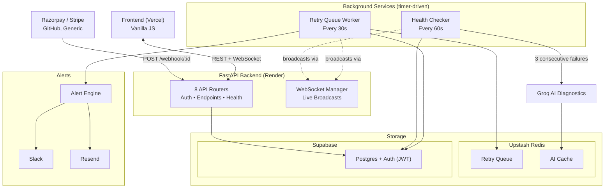

<div align="center">

# Webhook Monitor
### Production-grade webhook reliability platform with AI-powered diagnostics
</div>

## The Problem

**Webhook providers assume your endpoint is always available. Reality is different.**

A temporary outage, slow response, or deployment issue can cause webhook deliveries to fail. These failures are often discovered hours later, after users report missing updates or transactions.

Webhook Monitor eliminates this blind spot by capturing every event, retrying failed deliveries, continuously checking endpoint health, and providing AI-powered diagnostics with real-time alerts.

## Architecture


## File Structure
```
├── backend/
│   ├── main.py                    # FastAPI app, CORS, lifespan scheduler init
│   ├── routers/
│   │   ├── auth.py                # Signup, login, JWT verification
│   │   ├── endpoints.py           # CRUD for monitored endpoints
│   │   ├── webhooks.py            # Inbound receiver + event query
│   │   ├── health.py              # Health check results + manual trigger
│   │   ├── delivery.py            # Retry queue status + force-retry
│   │   ├── ai.py                  # Diagnosis + payload summarization
│   │   ├── alerts.py              # Alert history + preferences
│   │   └── dashboard.py           # Aggregated summary + WebSocket
│   ├── models.py                  # Pydantic request/response schemas
│   ├── database.py                # Supabase client factory (service_role + anon)
│   ├── services/
│   │   ├── webhook_parser.py     # Provider-specific payload normalization
│   │   ├── health_monitor.py     # Scheduled health check logic
│   │   ├── retry_service.py      # Redis queue + exponential backoff
│   │   ├── ai_service.py          # Groq integration + caching
│   │   └── alert_service.py       # Slack + Resend notification dispatch
│   ├── requirements.txt
│   └── render.yaml                # Render.com deployment config
│
├── frontend/
│   ├── index.html                 # Dashboard UI (no build step)
│   ├── login.html                 # Auth pages
│   ├── signup.html
│   ├── js/
│   │   ├── auth.js                # Token management, route guards
│   │   ├── api.js                 # Fetch wrapper with auto-auth headers
│   │   ├── dashboard.js           # Main dashboard logic
│   │   └── websocket.js           # WS connection + auto-reconnect
│   ├── css/
│   │   └── styles.css             # Tailwind CDN + custom overrides
│   └── vercel.json                # Vercel SPA routing config
│
├── migrations/
│   ├── supabase_schema.sql        # Initial tables + RLS policies
│   ├── supabase_phase2.sql        # Health check tables
│   ├── supabase_phase3.sql        # Delivery attempts audit
│   ├── supabase_phase4.sql        # Alert tables
│   ├── supabase_phase6.sql        # AI diagnosis tables
│   └── supabase_phase7.sql        # WebSocket support columns
│
└── docs/
    ├── PHASE2_README.md           # Build history per phase
    ├── PHASE4_README.md
    ├── PHASE5_README.md
    ├── PHASE7_README.md
    ├── PHASE8_README.md
    └── interview_questions.pdf    # 27-topic technical deep-dive
```

## Tech stack

Backend       —   FastAPI, Uvicorn, Pydantic  
Database      —   Supabase (PostgreSQL) with Row Level Security  
Queue / cache —   Upstash Redis  
Scheduling    —   APScheduler  
AI            —   Groq (Llama 3) for failure diagnosis and payload summarization  
Auth          —   Supabase Auth (email/password, JWT)  
Alerting      —   Slack incoming webhooks, Resend (email)  
Real-time     —   native WebSockets, no Socket.IO  
Frontend      —   vanilla JavaScript, Tailwind CSS (CDN), semantic HTML5, no framework, no build step  
Deployment    — Render (backend), Vercel (frontend)

## Database Schema

| Table | Purpose |
|-------|---------|
| `endpoints` | Stores registered webhook endpoints, owner (`user_id`), secrets, and alert preferences. |
| `webhook_events` | Records every incoming webhook event, parsed payload, delivery status, and AI-generated summary. |
| `health_checks` | Stores scheduled health check results, response times, status codes, and CDN detection. |
| `delivery_attempts` | Logs every webhook delivery attempt, retry, response code, and latency. |
| `alerts_log` | Tracks endpoint failure and recovery events. |
| `alert_deliveries` | Records the delivery status of Slack and email notifications for each alert. |
| `ai_diagnoses` | Stores AI-generated failure diagnoses and payload summaries for future analysis. |

## Running Locally

### 1. Clone the repository

```bash
git clone https://github.com/<your-username>/webhook-monitor.git
cd webhook-monitor
```

### 2.Setup

```bash
cd backend
python -m venv venv
venv\Scripts\activate
pip install -r requirements.txt
uvicorn main:app --reload
```

The backend will be available at:

- API: http://localhost:8000
- Swagger Docs: http://localhost:8000/docs

---
